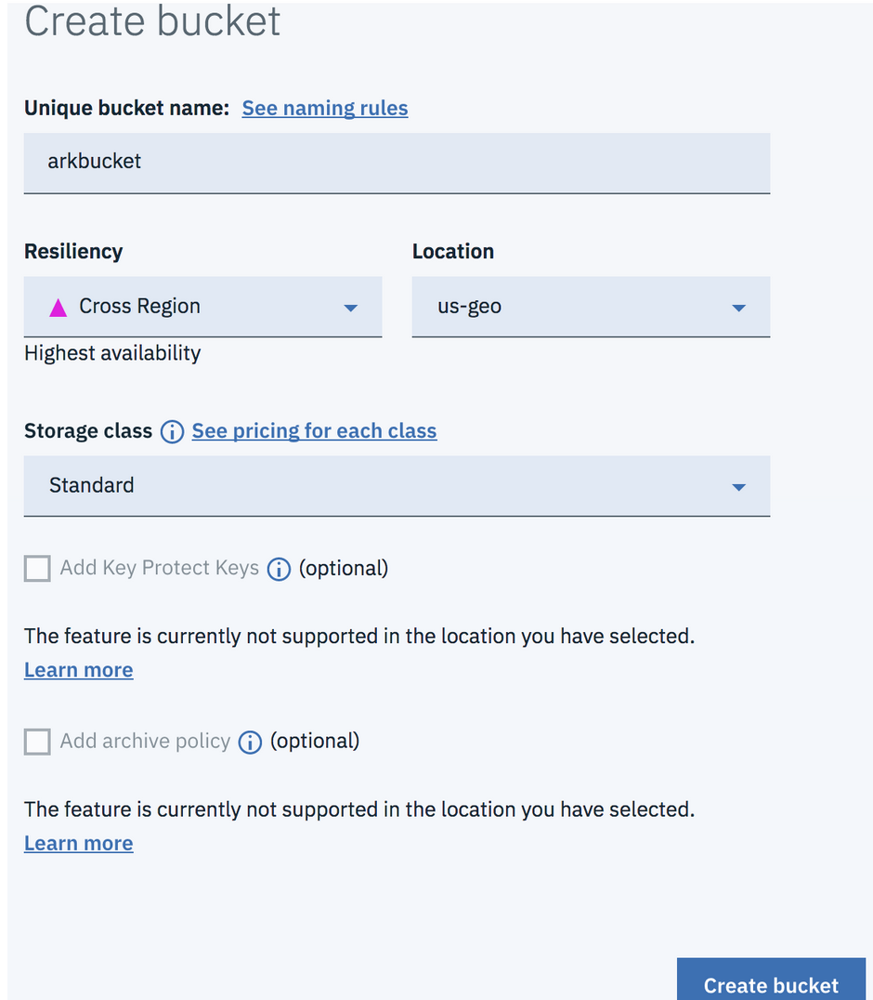
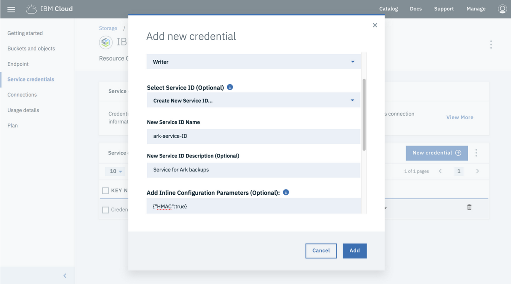
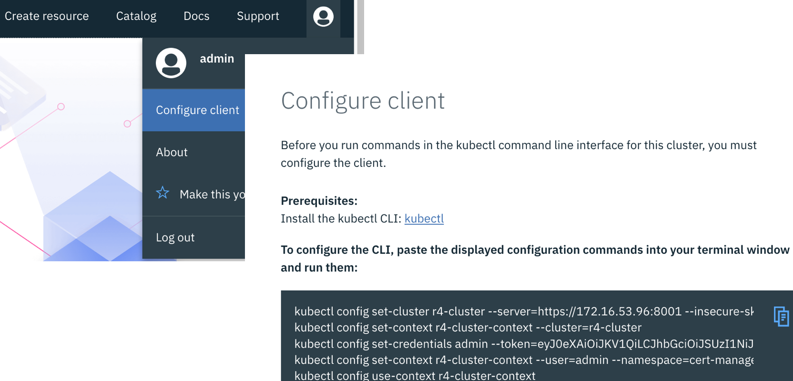

# Backup and Restore of Applications running on ICP

In this document, we will describe how to back up and restore your applications running on IBM Cloud Private (ICP) environment using Ark and Restic.


### Introduction to Veloro (previously known as Ark) and Restic

[Veloro][1]; previously known as Ark is an open source, kubernetes backup recovery utility from Heptio. As of writing this article, the Heptio team and the community contributors are aggressively working on the first Velero release and migrating current Ark deployments to Velero. For the purpose of this article we will refer to the backup utility as Ark.

Ark provides backup and restore capabilities for all or part of your kubernetes cluster. It backs up all tags, deployments, persistent volumes, and more. Since v0.6.0, Ark has adopted a plugin model which enables anyone to easily implement additional object and block storage backends, outside of the main Ark repository.

With the [integration of Restic][3], Ark now natively supports backing up and restoring data from any Kubernetes volume or persistent volume. Restic takes file-level backups of your data, and has several key features that make it a great fit for Ark’s needs:

Supports multiple storage backends, including IBM Cloud Object Storage, Amazon S3, Google Cloud Storage, Azure Blob Storage, and Minio
* Fully encrypts backup data at rest and in transit with AES-256 in counter mode
* Only backs up data that has changed since the prior backup, using content-defined chunking
* De-duplicates data within a single backup for efficient use of storage

As Public Cloud Providers continue to drive down costs of Object Storage services; using Ark and Restics with Object storage as a backup target makes a promising option to consider. We will explore this very scenario for Application backup and restore operations below.

### Scope

In this guide, we will set up and configure the Ark client on a local machine, and deploy the Ark server into our Kubernetes cluster. We'll then deploy a sample Nginx app that uses a Persistent Volume for logging, backup the application to IBM Cloud Object Storage, simulate a disaster recovery scenario and restore the application with its persistent volume.

We are following the [companion guide for IBM Cloud Kubernetes Service (IKS)][2] with the following differences:
1. Using ICP vs. IKS
2. Using NFS storage as the storage options for the ICP cluster vs. GlusterFS

This proves:
1. The underlying framework including kubernetes is exactly the same in ICP and IKS as the open sourced kubernetes project; supporting portability across public, private and multi-cloud environments.
2. Ark and Restic is storage agnostic.

In order to follow all of the recommendations in this guide, it is assumed that you have already provisioned an ICP cluster and set up NFS storage for the same, and are able to have access to your cluster immediately post-install.

A simple overview of the process is as follows:

    Login (or first create) to your IBM Cloud Account.
    Create and configure IBM object storage service.
    Install Ark Client.
    Configure Ark and Restic.
    Install Ark and Restic into your ICP cluster.
    Deploy an application and make a change to the PV content.
    Run Ark backup.
    Delete the application and PV, simulating disaster.
    Restore application from Ark/Restic Backup and all is well again.

## Task 1: Setup your Backup target
###Step 1. Login to the IBM Cloud (or create you free account if this is your first time)

https://console.cloud.ibm.com
Step 2. Create an IBM Cloud Object Storage Service Instance

To store Kubernetes backups, you need a destination bucket in an instance of Cloud Object Storage (COS) and you have to configure service credentials to access this instance.

    If you don’t have a COS instance, you can create a new one, according to the detailed instructions in Creating a new resource instance.
    The next step is to create a bucket for your backups. Ark and Restic will use the same bucket to store K8S configuration data as well as Volume backups. See instructions in Create a bucket to store your data. We are naming the bucket arkbucket and will use this name later to configure Ark backup location. You will need to choose another name for your bucket as IBM COS bucket names are globally unique. Choose “Cross Region” Resiliency so it is easy to restore anywhere.




    The last step in the COS configuration is to define a service that can store data in the bucket. The process of creating service credentials is described in Service credentials. Several comments:

```bash

    Your Ark service will write its backup into the bucket, so it requires the “Writer” access role.
    Ark uses an AWS S3 compatible API. Which means it authenticates using a signature created from a pair of access and secret keys — a set of HMAC credentials. You can create these HMAC credentials by specifying {“HMAC”:true} as an optional inline parameter. See step 3 in the Service credentials guide.
```

    

    After successfully creating a Service credential, you can view the JSON definition of the credential. Under the ```bash cos_hmac_keys``` entry there are ```bash access_key_id``` and ```bash secret_access_key```. We will use them later.


## Task 2: Setup Ark

Step 3. Download and Install Ark

    Download Ark as described here: https://heptio.github.io/ark/v0.10.0/. A single tar ball download (https://github.com/heptio/ark/releases) should install the Ark client program along with the required configuration files for your cluster.
    Note that you will need Ark v0.10.0 or above for the Restic integration as shown in these instructions.
    Add the Ark client program (ark) somewhere in your $PATH.

Step 4. Configure Ark Setup

    Configure your kubectl client to access your IKS deployment.
    From the Ark root directory, edit the file config/ibm/05-ark-backupstoragelocation.yaml file. Add your COS keys as a Kubernetes Secret named cloud-credentials as shown below. Be sure to update <access_key_id> and <secret_access_key> with the value from your IBM COS service credentials. The remaining changes in the file are in the section showing the BackupStorageLocation resource named default. Configure access to the bucket arkbucket (or whatever you called yours) by editing the spec.objectstore.bucket section of the file. Edit the COS region and s3URL to match your choices. The file should look something like this when done:

apiVersion: v1
kind: Secret
metadata:
  namespace: heptio-ark
  name: cloud-credentials
stringData:
  cloud: |
    [default]
    # UPDATE ME: the value of “access_key_id” of your COS service credential
    aws_access_key_id = <access_key_id>
    # UPDATE ME: the value of “secret_access_key” of your COS service credential
    aws_secret_access_key = <secret_access_key>
---
apiVersion: ark.heptio.com/v1
kind: BackupStorageLocation
metadata:
  name: default
  namespace: heptio-ark
spec:
  provider: aws
  objectStorage:
    bucket: arkbucket
  config:
    s3ForcePathStyle: "true"
    s3Url:  http://s3-api.us-geo.objectstorage.softlayer.net
    region: us-geo

Step 5. Login to your ICP cluster



After you login to the cluster's Admin Console, copy the client configurations from your profile
Step 6. Deploy Ark into your IBM ICP Instance

Run the following commands from the Ark root directory:
kubectl apply -f config/common/00-prereqs.yaml

kubectl apply -f config/ibm/05-ark-backupstoragelocation.yaml

kubectl apply -f config/ibm/10-deployment.yaml

kubectl apply -f config/aws/20-restic-daemonset.yaml

Verify that Ark and Restic are running correctly on your ICP cluster with the following command:

kubectl -n heptio-ark get pods

which should show pods running similar to this:

NAME READY STATUS RESTARTS AGE
ark-5464586757-q2crr 1/1 Running 0 5m
restic-7657v 1/1 Running 0 5m
restic-hh677 1/1 Running 0 5m
restic-mb9vh 1/1 Running 0 5m

Note above that the count may vary as there is one Ark pod and a Restic Daemon set (in this case 3 pods, one per worker node).

## Back up your ICP environment

Here are the steps you should follow to take an initial backup your ICP environment.  Keep in mind our guiding principle:  **We do not take backups of nodes that we don't restore and just replace instead (Worker and Proxy).**

### Stop the ICP Servers (Virtual Machines)

For the process used in this guide you do not need to stop the entire cluster all at once, but it is important to note a few items.  When attempting to bring down an entire cluster always stop the Master nodes first otherwise they will begin rescheduling and attempting to recover.  This is not desired when you are attempting to acheive an organized steady state.  Once the Masters have been stopped you are free to proceed in any order you please.  For cluster restart proceed in reverse and pring the Masters up once all other nodes have resumed.

> Follow other best practices such as if you are downing worker nodes for some reason you will want to use the drain command prior to taking them offline.

Stop kubelet first, Kubelet may attempt to restart Docker processes otherwise.

```sudo systemctl stop kubelet```

Next stop Docker:   ```sudo systemctl stop docker```

Confirm that all processes are shutdown (be patient):  ```top```

and that all related network ports are no longer in use:  ```netstat –antp```

Once you have completed the other tasks for performing system maintenance or taking backups, to restart the cluster simply reboot the nodes (Masters Last).

> Yes, some of the time you can actually start the processes explicitly as stated below, but this is a good opportunity to reaffirm that these systems will start on their own.  Also, this team has seen much more consistent success via the shutdown -r now method.

If you wish to restart without a reboot, start Docker first and then follow with kubelet:

```sudo start docker
```

Pause for a moment then:

```sudo start kubelet```

You can follow the logs for kubelet:  ```sudo journalctl -e -u kubelet```

### Taking an Infrustructure Level Backup of Your Cluster

We recommend taking the backup immediately follwing the ICP installation.

> In the case that you are performing an upgrade, post upgrade, follow this procedure for taking a cold backup once again.  Retain both the post-upgrade and post-initial-install backups of the Master nodes.  As a special note, if you have an HA cluster you should be able to accomplish the backup of the Master nodes without having an outage.  Simply back them up one at a time.

The tool to use for the backup depends on your hosting environment and accepted tools..

* For a VMware environment, you can use VMware snapshot, Veaam, IBM Spectrum Protect, or any other approved snapshot tool that allows you to store this snapshot in perpetuity (forever).
* For a public cloud environment, use the backup solution preferred by the cloud provider.
* For any other environment, you can always use the storage-provided mechanism for backup, or other solution that allows you to accurately recreate the original state of the infrastructure and build.

### Validate your Backup

No backup is **good** until we test it by using it to successfully restore our cluster (or component thereof).

Follow these steps to validate your backup:

* Destroy the node (or nodes) via whichever means fits your potential / expected scenario
* Follow the provided steps to restore what was destroyed in the previous step
* Verify the validity of whatever was destroyed and restored

> The fact that an ICP node is running is a good thing, but that does not necessarily mean your restoration was successful.  In your non-production environments perform steps that force workload mobility.  Verify that you Masters are able to behave like Masters, Proxies like Proxies, .... you get the idea.


### References
[1] https://github.com/heptio/velero
[2] https://medium.com/@mlrborowski/using-ark-and-restic-to-provide-dr-for-ibm-kubernetes-service-cae53cfe532
[3] https://blog.heptio.com/ark-v0-9-alpha-now-with-restic-14ad6b402ab3
